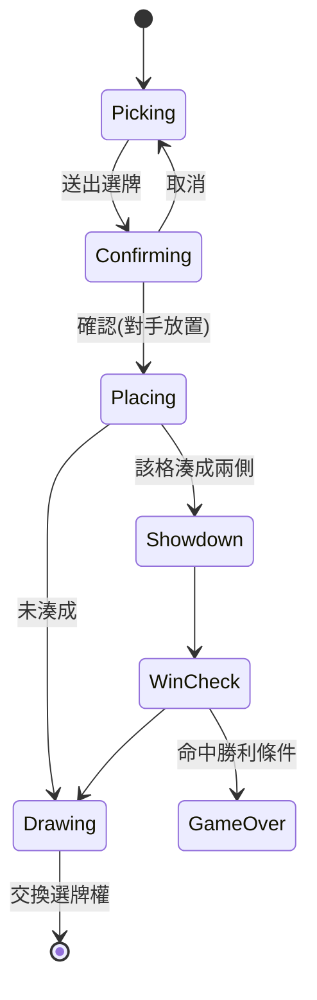

# Seven Hand Poker — 開發規格書 (SPEC v1.0)

> 文件驅動開發的權威文件。實作以本文件為準;若程式與本文件衝突,先更新本文件再改碼。

---

## 0. 目標與範圍
- 網頁遊戲(非 App),部署於 **GitHub Pages**(純靜態)。
- 支援 **桌面 + 手機橫放**,響應式。
- 兩種模式:**對戰電腦(單機)** 與 **雙人連線對戰**。
- 風格:**Q 版 + MSN 紅絲絨桌布 + 金幣發亮**,發牌動畫流暢、介面一致好看。
- 目標一次做到 90%+ 完成度。

---

## 1. 名詞定義
| 名詞 | 說明 |
|---|---|
| 格子 (Slot) | 中央一排 **7 個**位置;每個位置有一枚金幣,上側屬對手 (b1–b7)、下側屬你 (a1–a7)。 |
| 格子牌組 (Pile) | 放進單一格子的 1–5 張牌,即該格戰力。 |
| 發牌牌堆 (Deck) | 中央對戰區正左方的牌堆,發牌/補牌動畫來源。 |
| 選牌 (Pick) | 從手牌選 1–5 張送出,由**對手**決定放進你哪個空格。 |
| 放置 (Place) | 你決定把對手選出的那批牌放進他哪個空格。 |
| 對決 (Showdown) | 某格上下兩側都有牌時,立即比牌,勝方得該格金幣。 |
| 補牌 (Draw) | 每完成一次放置後依表補牌。 |
| 選牌權 (Turn) | 目前輪到誰「選牌」;選完由對手放置後交換。 |

---

## 2. 核心規則(定稿)
1. 一副 52 張。開場雙方各發 **10 張**。
2. **擲硬幣**決定誰先選牌:硬幣兩面各放一位玩家頭像,落定顯示誰的頭像就由該玩家**先選牌**。
3. 選牌權**交替**:A 選 → B 放置 → B 選 → A 放置 → …
4. 每次選 **1–5 張**;每格上限 **5 張**;放置只能放進對方**尚未使用的空格**。
5. 放置後若某格上下都有牌 → **立即對決**;放進空的一側則等待。
6. 每完成一次放置後補牌,順序 **3 / 3 / 3 / 3 / 2 / 2**(共 6 次補牌;第 7 次放置後不補)。最多可累積抽到 26 張。
7. **手牌不需用完**:7 格放滿(各方 7 次放置)或先達成勝利條件即結束,剩牌作廢。玩家可自由選 1–5 張,不強制下限。
8. 勝利條件(每次對決後檢查,擇一即勝):
   - **先取得 4 枚金幣**,或
   - **金幣三連線**(相鄰 3 格金幣同屬一方)。
9. **情報戰**:對手選牌時,你即時看到他手牌「被推上來的張數與位置」(僅背面);看不到點數,也看不到他的排序模式。

### 2.1 一副牌用量驗證
- 兩玩家各上限 26 張(10 初始 + 3+3+3+3+2+2)= 52 張整副剛好用完,不需洗第二副。
- 若提早分出勝負,剩餘未發牌無意義,直接結束。

---

## 3. 比牌規則(梭哈式)
牌型 高→低:**同花順 > 鐵支(四條) > 葫蘆 > 同花 > 順子 > 三條 > 兩對 > 對子 > 高牌**。

一手牌 1–5 張,依張數可成立的最高牌型:
| 牌型 | 最少需要張數 |
|---|---|
| 同花順 / 葫蘆 / 同花 / 順子 | **剛好 5 張**(4 張以下一律不成立) |
| 鐵支(四條) | 4 |
| 兩對 | 4 |
| 三條 | 3 |
| 對子 | 2 |
| 高牌 | 1 |

> **關鍵規則**:順子與同花(含同花順)**只有在該格剛好 5 張時才可能成立**。4 張以下再怎麼排都不算順子/同花。

### 3.1 比較演算法(保證唯一勝負)
1. 比 **牌型等級**,高者勝。
2. 同牌型 → 比**關鍵牌點數**(如對子比對子點數、順子比最大牌),再比 **kicker**(剩餘牌由大到小逐張比)。點數序:A > K > Q > J > 10 > … > 2(A 於順子可當最小:A2345)。
3. 若點數完全相同 → 比**最高關鍵牌的花色**:**黑桃 > 紅心 > 方塊 > 梅花**。
- 因一副牌不重複,花色決勝保證永遠分出勝負,不會真平手。
- 不同張數比較:各自取「能組成的最高牌型」後,再依上述順序比較;張數多者較易組出高牌型,形成放置策略張力。

---

## 4. 遊戲流程

```mermaid
flowchart TD
    A[主畫面] --> B{開始遊戲彈窗}
    B -->|對戰電腦| G[進入遊戲: 建立本地AI對手]
    B -->|建立對戰| R1[建房→顯示3碼房號+複製連結]
    B -->|加入對戰| R2[輸入3碼房號→加入]
    B -->|自由匹配(停用)| X[灰階不可按]
    R1 --> W[等待對手加入]
    R2 --> W
    W --> G
    G --> C[擲硬幣動畫:頭像落定=先選牌方]
    C --> LOOP[回合循環]
    LOOP --> P1[選牌方選1~5張→送出確認彈窗]
    P1 --> P2[放置方選對方空格放入]
    P2 --> SD{該格兩側都有牌?}
    SD -->|是| SHOW[對決彈窗比牌→金幣傾倒]
    SD -->|否| DRAW
    SHOW --> WIN{達成4勝或三連線?}
    WIN -->|是| END[勝利/失敗彈窗]
    WIN -->|否| DRAW[放置方補牌]
    DRAW --> SWAP[交換選牌權] --> FULL{7格已滿?}
    FULL -->|否| LOOP
    FULL -->|是| END
    END -->|再玩一場(單機:自動;連線:雙方同意)| C
    END -->|離開| A
```

### 4.1 單回合狀態機


---

## 5. 畫面規格

### 5.1 主畫面 (Menu)
- 標題 `Seven Hand Poker`(大圖由使用者提供,程式預留圖位與基本文字備援樣式)。
- 三顆主按鈕:**開始遊戲 / 如何遊玩 / 設定**。
- 「開始遊戲」彈窗 4 顆:
  1. 對戰電腦 → 直接進單機遊戲。
  2. 建立對戰 → 進房,顯示 **3 碼房號(000–999)** + **複製連結**鈕。
  3. 加入對戰 → 輸入 3 碼房號加入。
  4. 自由匹配 → 灰階停用(未來大廳匹配)。

### 5.2 如何遊玩 (HowToPlay)
- 圖文說明:目標、勝利條件(4 勝 / 三連線)、牌型大小、花色決勝、選/放/補牌流程、情報戰。

### 5.3 設定 (Settings)
- 音樂開關 + 音量;音效開關 + 音量(音樂檔由使用者後補;音效內建)。
- 主題:牌背、桌布切換(先各一款,架構支援多款)。

### 5.4 遊戲畫面 (Game) — 版面
```
┌──────────────────────────────────────────────────────┐
│ [☰ 選單:離開/音樂/音效/主題]              [對手頭像 🐱] │
│              對手手牌(背面・顯示被選取的位置)             │
│        ┌────────────────────────────────┐            │
│ [發牌  │  b1  b2  b3  b4  b5  b6  b7     │  [排序:點/花]│
│  牌堆] │  🪙  🪙  🪙  🪙  🪙  🪙  🪙     │  [排序:大/小]│
│        │  a1  a2  a3  a4  a5  a6  a7     │            │
│        └────────────────────────────────┘            │
│              你的手牌(點選上推 / 再點縮回)              │
│ [你的頭像 🐶]                                          │
└──────────────────────────────────────────────────────┘
```
- **發牌牌堆**:中央 7 格帶的**正左方**(發牌動畫來源,避免偏向)。
- **排序鈕 ×2**:中央 7 格帶的**正右方**,上下排列;與發牌區左右對稱。
  - 鈕①:依點數 / 依花色(toggle)。
  - 鈕②:大→小 / 小→大(toggle)。
  - 只影響自己手牌顯示;抽到新牌自動併入目前排序。
- **左上選單**:離開遊戲、音樂/音效、主題切換。
- 頭像:對手右上、自己左下,均為隨機**動物頭像**。

### 5.5 手牌互動
- 手牌初始齊平。點一張 → 往上推(選取);再點同張 → 縮回。
- 可同時選 1–5 張;超過 5 張不可再選(給提示)。
- 對手選牌時,你端即時看到他手牌對應位置的**背面卡片上推**(僅位置與張數)。

### 5.6 放大鏡查看
- **桌面**:hover 到「可查看的格子」→ 游標/圖示變放大鏡 → 點擊彈窗。
- **手機**:直接點擊該格 → 彈窗。
- 可查看範圍:
  - 自己 **a1–a7 有放牌的**(蓋牌或開牌皆可)。
  - 對手 **b1–b7 已對決翻開的**。
  - 對手**未翻開的蓋牌不可看**。

### 5.7 彈窗清單
| 彈窗 | 說明 |
|---|---|
| 擲硬幣 | 開場儀式動畫,頭像雙面硬幣翻轉落定 → 先選牌方。 |
| 送出確認 | 顯示所選 1–5 張 + 目前組成牌型;可「取消 / 確認」。 |
| 對決 | 上下兩手牌翻開對比、標牌型;金幣往勝方傾倒動畫(參考圖三/四)。 |
| 查看牌 | 放大鏡點擊後顯示該格已開牌。 |
| 結束 | 勝利/失敗 + 「再玩一場 / 離開」。單機同意即續;連線需雙方同意,一方拒絕則散房回大廳。 |

---

## 6. 連線架構 (Firebase Realtime Database)

### 6.1 房間資料模型 `rooms/{roomId}`
```
rooms/{roomId}:
  status: "waiting" | "playing" | "ended"
  createdAt: <server ts>
  hostId, guestId
  players: { host:{name,avatarSeed,connected,lastSeen}, guest:{...} }
  seed: <host 產生的洗牌種子>
  turn: "host" | "guest"           # 目前選牌權
  phase: "coinToss" | "picking" | "placing" | "showdown" | "ended"
  coinResult: "host" | "guest"
  slots[7]: { a:{owner,cards[],faceUp}, b:{...}, coinOwner }
  hands: { host:{count, selectedIdx[]}, guest:{count, selectedIdx[]} }  # 只存張數與選取位置,不存點數
  privateHands: 只在各自客戶端記憶體,不上傳完整點數(見 6.3)
  lastMove: { type, by, payload, ts }
  rematch: { host:bool, guest:bool }
```

### 6.2 權威與流程
- **建房方 (host) 為裁判**:負責洗牌(用 seed + 種子亂數,流程可重建)、發牌、補牌、判定對決與勝負,將結果寫入 DB。
- guest 只送「選牌 / 放置」意圖,host 驗證後更新狀態。
- 用 seed 讓雙方可重建牌序、支援重連。

### 6.3 隱藏資訊策略
- 對手手牌只同步 **張數 + 被選取索引**(背面呈現),真實點數不廣播。
- 格子牌僅在**對決翻開**或**放大鏡查看已開格**時揭露點數。
- **已知限制(v1 接受)**:無伺服器下 host 客戶端記憶體必然握有整副牌,技術上可被 host 端偷看。給朋友玩可接受;不做加密承諾。

### 6.4 建立/加入
- 建房:host 產生 3 碼數字房號(避開 DB 現存活躍房號,衝突重試),寫入 `rooms/{code}`,顯示房號 + 複製連結 `<pages-url>/?room=<code>`。
- 加入:輸入房號或帶 `?room=` 進入 → 設 guestId → status=playing → 擲硬幣。

### 6.5 斷線/重連
- 逾時 **90 秒**。斷線時對方顯示「對手斷線,等待重連 1:30…」倒數。
- 用 Firebase `onDisconnect` 更新 `connected/lastSeen`;同房號重進可接回狀態。
- 逾時未回 → 判離線,散房回大廳。

---

## 7. 電腦對手 AI(單一合理難度)
- **選牌**:評估手牌可組較強牌型(湊對/三條/同花方向),保留彈性;依局勢決定投入張數。
- **放置**:把對手強手放進自認能贏或願意犧牲的格子;優先阻擋對手三連線、搶自己第 4 勝。
- 全前端本地運算,不需連線。難度 v1 單一,架構預留日後分級。

---

## 8. 技術堆疊

| 層面 | 選型 |
|---|---|
| 框架 | React 18 + TypeScript + Vite |
| 狀態 | Zustand + 純函式回合狀態機 |
| 動畫 | Framer Motion(必要時 GSAP 做發牌時間軸) |
| 音效 | Howler.js + WebAudio 合成簡易音效 |
| 連線 | Firebase Realtime Database |
| 測試 | Vitest(規則引擎單元測試) |
| 部署 | GitHub Actions → GitHub Pages(`vite base` 設定) |
| 字型 | self-host(不依賴外部 CDN) |

### 8.1 專案結構
```
src/
  game/        # 純函式規則引擎(可測): deck / shuffle / deal / evaluate / compare / winCheck / draw / ai
  state/       # Zustand store + 回合狀態機
  net/         # Firebase 房間同步、重連(含 null 佔位使單機免設定)
  ui/
    screens/   # Menu / HowToPlay / Settings / Game
    components/# Card / CardBack / Slot / Coin / HandRow / Avatar / Deck / SortButtons / popups...
    theme/     # design tokens (CSS 變數)
  audio/       # Howler + WebAudio 掛勾
  assets/      # 使用者可覆蓋的 PNG 圖位 + 內建 SVG
docs/
  SPEC.md
  FIREBASE_SETUP.md   # 連線階段補上的逐步設定指南
```

---

## 9. 設計系統 (Design Tokens)
- 集中一組 CSS 變數:主色(紅絲絨)、金幣金、強調、文字漸層/鍍層、字型、圓角、陰影、按鈕樣式。
- **主畫面到遊戲畫面共用同一套 tokens**,可一次替換。
- 按鈕:統一邊框、內文可漸層/鍍層、hover/press 有回饋(視覺 + 音效)。

### 9.1 美術資產(可事後覆蓋 PNG)
| 資產 | v1 做法 | 覆蓋 |
|---|---|---|
| 主畫面標題大圖 | 使用者提供(預留圖位 + 文字備援) | — |
| 動物頭像 | 程序化 SVG 隨機生成(貓/狗/雞/鳥/蛇…),每局隨機 | 可補 PNG |
| 牌背 | 內建 **藍色系** SVG 一款(桌面為紅,故牌背避開紅) | 支援多款切換 |
| 桌布 | 紅絲絨 SVG/CSS(含弧形切線質感)一款 | 支援多款切換 |

---

## 10. 動畫與音效
- **動畫**:發牌飛入(從左側牌堆)、選牌上推、翻牌、金幣傾倒、擲硬幣、勝負彈窗、放大鏡彈窗。
- **音效**(內建,可開關):
  - 點擊:單音「噠」。
  - hover 換牌:單音「逼」。
  - 對決 / 勝負:稍豐富的短音效(可混音)。
- **音樂**:背景音樂檔由使用者後補,先留掛勾與音量控制。

---

## 11. 響應式 / 手機橫放
- 中央對戰區採固定長寬比容器,整體等比縮放以塞入視窗寬度。
- 手牌在窄畫面採扇形/重疊排列。
- 手機橫放為主要遊玩姿勢;直放時提示「請橫置手機」。

---

## 12. 建置里程碑
1. **骨架 + 設計系統 + 佔位美術**:Menu / HowToPlay / Settings + 響應式外殼 + 頭像/牌背/桌布 SVG。
2. **規則引擎 + 單元測試**:洗牌/發牌/比牌/勝負/補牌。
3. **單機對電腦完整流程**:含所有彈窗與動畫、擲硬幣、放大鏡、續局。
4. **Firebase 連線**:建房/加入/同步/重連(此階段帶使用者開 Firebase 專案)。
5. **打磨**:音效、手機橫放調校、GitHub Pages 部署。

---

## 13. 決策紀錄(已確認)
- 前端 React + Framer Motion;連線 Firebase RTDB。
- 7 格 = 7 次放置,每格上限 5 張,手牌不需用完。
- 不同張數比牌:取各自最高牌型比較。
- 順子/同花僅 5 張成立(4 張以下不成立)。
- 先手 = 擲硬幣頭像落定方先選牌。
- 房號 3 碼數字 000–999。
- 重連逾時 90 秒。
- 畫風 Q 版 + 紅絲絨;版面擺法參考綠桌圖二、配色用紅絲絨。
- 頭像隨機動物;牌背先藍色一款,牌背/桌布皆可切換主題。
- 連線防作弊 v1 接受 host 端可見整副牌之限制。

---

## 14. 實作期間定案的流程/顯示決策(補充)

> 這些在做 UI 時敲定,屬邏輯/顯示規則,一併記錄。畫面/版面細節見 [DESIGN.md](DESIGN.md)。

- **角色固定**:p1 = host = **貓**、p2 = guest = **鳥**(不再隨機動物)。單機時玩家=貓、電腦=鳥。
- **事件嚴格順序化(不可同時跑)**:選牌 → 對手放置 → **若湊成對決,先完整跑完對決** → **再補牌** → 換手。引擎階段:`pick → place → showdown → draw`(`applyPlace` 只放置+判定,`applyDraw` 才補牌並換手;`state.ts`)。
- **對決節奏**:放置後先看到金幣傾倒,約 0.55 秒才彈對決窗;關閉後約 0.48 秒才補牌(離散步驟,發牌動畫一致)。
- **收官對決一定先跑完**:即使某次放置同時湊成對決**又**達成勝利條件(4 勝/三連/滿盤),仍**先完整顯示該對決彈窗**,玩家按「繼續」後才跳結束彈窗——不可直接跳結束畫面,否則玩家不知自己輸/贏在哪一格。引擎:`applyPlace` 命中勝利時只記錄 `winner/winReason`,若同時有對決則階段維持 `showdown`;`resolveShowdown` 見到 `winner` 才轉 `ended`(`state.ts`)。
- **我方放到桌上的牌**:未對決前**蓋牌顯示**(可用放大鏡看自己);對手的牌對決翻開後才可看。放大鏡:點到已翻開格的牌(含被金幣蓋住處)即可看。
- **對手選牌可見性**:對手選的牌依其**真實手牌位置**推出(鏡像往下),並在其頭像下顯示「N 張」;持續到我放置為止。
- **牌面**:大點數 + 大花色(單一呈現),**傳統兩色**(黑/紅)但用清晰手繪花色形狀加強辨識;非四色牌。
- **預設排序**:每局開始 = 依點數、由小到大。
- **對決彈窗**:標題「第 X 格・對決!」;獲勝方那列靠右顯示「獲得 🪙」。
- **連線階段 2(牌局同步)實作要點**:host 為裁判、本機跑 `game/state.ts`;host 每次引擎變動就把**消毒過的 guest-view** 寫進 `rooms/{code}/game`(host 手牌/牌堆只給張數、host 蓋牌堆未對決前只給張數→對決後才給真牌;guest 自己的手牌與牌組給真牌)。guest 只送 `intent`(pick/place/continue)到 `rooms/{code}/intent`,host 消化後套用。序列化在 `src/net/sync.ts`,橋接在 `src/net/netgame.ts`。
- **連線階段 3 實作要點**:
  - **即時選牌(情報戰)**:選牌方把「排序後的推出位置」`{total, idx}` **節流 ~0.7 秒**寫到 `rooms/{code}/live/{host,guest}`;對手監聽後用彈簧動畫滑動呈現(非瞬移),排序/收回都會即時反映。送出時帶 `sel`(排序位置)給對手,避免預覽→已送出跳位。獨立小節點以省流量。
  - **對決雙方各自確認**:雙方各按「繼續」才前進。我按後關掉自己的窗(可看翻開的牌)+顯示「等待對手確認…」,兩邊都 ack(host 追蹤 `acks`)才 resolveShowdown。
  - **擲硬幣(同步)**:host 開局隨機先攻、寫入 guest-view,雙方各自播放同一結果的擲硬幣動畫再進牌桌。
  - **再玩一場(雙方同意)**:`rooms/{code}/rematch={host,guest}`,兩邊都同意→host 開新局同步。
  - **斷線與重連(方法 A:同分頁 sessionStorage)**:`.info/connected` 維持在線狀態(`maintainPresence`,從大廳就開始跑)。建房/加房寫「重連指標」`shp.session={code,role}`(不含牌);**房主**另存完整引擎快照 `shp.host.{code}`(每步更新,永不進 RTDB);**訪客**不存牌局狀態(讀 RTDB)。**指標與快照存 `sessionStorage`(非 localStorage)**:與 clientId 一致、每分頁獨立(同瀏覽器 host/guest 兩分頁不會互相覆蓋)、重整(same-tab)保留、關分頁清除。App 載入先 `tryReconnect()`:指標仍在且房間有效且未 `abandoned` → 房主用快照還原引擎續玩、訪客重訂閱 guest-view,**且不重擲硬幣**(status 直接 playing)。
  - **自行離開 vs 意外斷線(用指標當 tag)**:按「離開遊戲/結束離開」= 自行離開 → 寫 `rooms/{code}/abandoned=role` + 清指標與快照;對手立即看到「對手已離開遊戲」(不倒數)。純重整/崩潰/背景節流 = 指標仍在 → 接回。對手單純掉線(presence=false 且無 abandoned)→ 90 秒倒數 overlay,**且 overlay 內附「離開遊戲」按鈕讓另一方可主動脫身、不用罰站**。
  - **大廳「已連線」以雙方都加入(guestId)判定,不依賴即時在線旗標**(避免背景分頁被節流時卡住)。
  - **限制**:重連綁定同一分頁(sessionStorage,涵蓋重整/崩潰未關分頁);**跨裝置或關掉分頁後接回同一局需真正登入**(暫不做)。
- **手機橫向為主**(非等比縮放,改**流動式滿版 + 固定格線**版面);**電腦版採「上限流動 + 雙置中」**(方框 `min(vw,1000) × min(vh,580)`,超過即凍結並水平+垂直置中、四周露紅絲絨,桌面卡片上限 66px,手牌貼近中央格),與手機共用同一套版面且**手機端逐位不變**。對決窗桌面加寬到 600px 防第 5 張換行、金幣外圈用亮金(勿深金→避免看似紅圈)。細節見 [DESIGN.md](DESIGN.md) §4。
